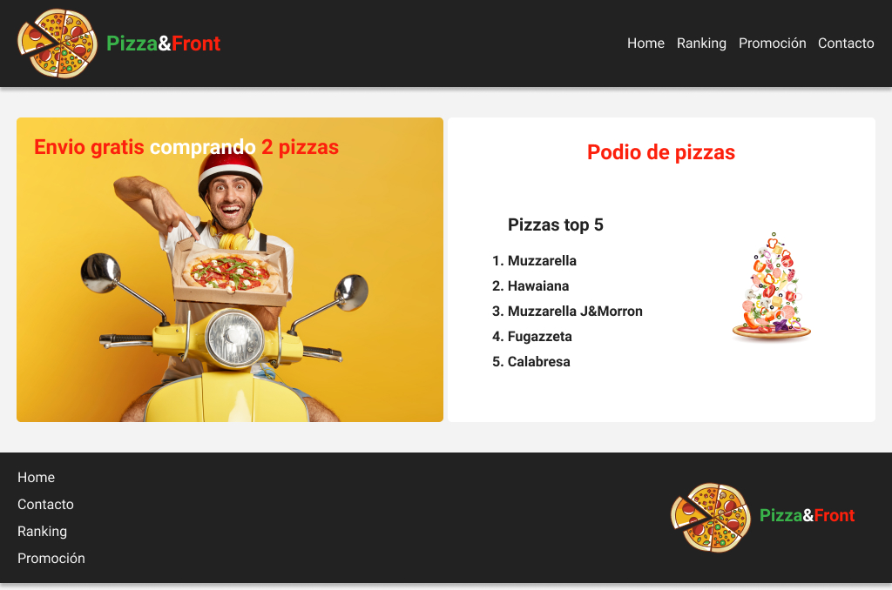

# Práctica C8S - Frontend I

Se solicita crear el maquetado con los conocimientos adquiridos hasta el momento y aplicando el modelo de layout de `flexbox`.  

El objetivo es desarrollar una recreación lo más cercana posible al siguiente diseño:  

